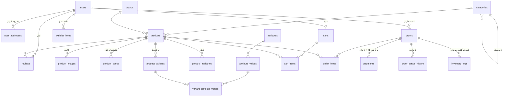

# ساختار پایگاه داده Itecho

مستند طراحی دیتابیس فروشگاه — نسخه ۱.۰

| مورد | مقدار |
|---|---|
| موتور | InnoDB |
| کدگذاری | `utf8mb4` / `utf8mb4_unicode_ci` |
| سازگاری | MySQL 5.7+ و MariaDB 10.2+ |
| تعداد جدول | ۲۶ |
| فایل ساختار | `database/schema.sql` |
| فایل داده اولیه | `database/seed.sql` |

---

## نصب روی هاست cPanel

۱. در cPanel → **MySQL Databases** یک دیتابیس و یک کاربر بسازید و کاربر را به دیتابیس اضافه کنید (همه دسترسی‌ها).
۲. وارد **phpMyAdmin** شوید و دیتابیس ساخته‌شده را انتخاب کنید.
۳. تب **Import** → فایل `database/schema.sql` را انتخاب و اجرا کنید.
۴. دوباره **Import** → این بار `database/seed.sql` را اجرا کنید.

> بدون نیاز به SSH، Composer یا هیچ ابزار خط فرمانی.

**حساب مدیر پیش‌فرض:** `admin@itecho.ir` — رمز: `Admin@12345`
⚠️ بلافاصله پس از نصب رمز را از پنل تغییر دهید.

---

## نمودار روابط



---

## جدول‌ها به تفکیک بخش

### تنظیمات و محتوا
| جدول | کاربرد |
|---|---|
| `settings` | تنظیمات کلید/مقدار: نام سایت، کلید زرین‌پال، SMTP، هزینه تحویل حضوری. ستون `sort_order` ترتیب نمایش فیلدها را در فرم پنل مشخص می‌کند. |
| `pages` | صفحات ثابت اینماد: قوانین، حریم خصوصی، درباره ما، تماس با ما، سوالات متداول |
| `contact_messages` | پیام‌های فرم تماس با ما |
| `banners` | اسلایدر و بنرهای صفحه اصلی |

### کاربران
| جدول | کاربرد |
|---|---|
| `users` | مشتری و مدیر کل در یک جدول، تفکیک با ستون `role` |
| `user_addresses` | دفترچه آدرس برای ارسال پستی |
| `verification_codes` | کد ۶ رقمی تایید ایمیل و بازیابی رمز (به صورت **هش‌شده**) |

### کاتالوگ
| جدول | کاربرد |
|---|---|
| `categories` | دسته‌بندی دو سطحی — **منبع مگا منو هم همین است** |
| `brands` | برندها برای فیلتر |
| `attributes` / `attribute_values` | ویژگی‌ها (رنگ، حافظه، رم) و مقادیرشان |
| `products` | اطلاعات اصلی محصول |
| `product_images` | گالری تصاویر |
| `product_specs` | مشخصات فنی متنی — فقط برای **نمایش** |
| `product_attributes` | ویژگی‌های محصول — فقط برای **فیلتر کردن** |
| `product_variants` | هر ترکیب با قیمت و موجودی مستقل |
| `variant_attribute_values` | اینکه هر Variant از چه مقادیری ساخته شده |

### خرید
| جدول | کاربرد |
|---|---|
| `carts` / `cart_items` | سبد خرید (مهمان با کوکی، کاربر با `user_id`) |
| `wishlist_items` | علاقه‌مندی‌ها |
| `orders` / `order_items` | سفارش‌ها و اقلام |
| `order_status_history` | تاریخچه تغییر وضعیت |
| `payments` | تراکنش‌های زرین‌پال |
| `inventory_logs` | گزارش کسر و برگشت موجودی |
| `reviews` | نظرات و امتیاز |

---

## تصمیم‌های کلیدی طراحی

### ۱. مبالغ به تومان و به صورت عدد صحیح
همه ستون‌های مالی `BIGINT UNSIGNED` هستند. در ایران واحد اعشاری نداریم و عدد صحیح، خطاهای گرد کردن اعشاری را کامل حذف می‌کند.

### ۲. قیمت و موجودی محصولات Variant‌دار
- محصول **بدون** Variant → `products.price` و `products.stock` ملاک است.
- محصول **با** Variant → قیمت و موجودی واقعی در `product_variants` است، و در جدول `products`:
  - `price` = **کمترین** قیمت Variantهای فعال
  - `stock` = **مجموع** موجودی Variantهای فعال

این هم‌گام‌سازی را یک تابع در کد انجام می‌دهد. دلیلش: مرتب‌سازی و فیلتر بازه قیمت در صفحه دسته‌بندی با یک کوئری ساده روی `products` انجام می‌شود و نیازی به `JOIN` و `GROUP BY` سنگین نیست — هم سریع‌تر است، هم کد ساده‌تری دارد.

### ۳. مگا منو از روی همان دسته‌بندی‌ها
جدول جداگانه برای منو ساخته **نشد**. سطح ۱ دسته‌بندی‌ها = ستون‌های منو، سطح ۲ = آیتم‌های زیر آن. مدیریت با `sort_order`، `is_active` و `show_in_menu` انجام می‌شود.

دلیل: هر ۶ آیتم منو در PRD خودشان دسته‌بندی هستند. جدول جدا یعنی ادمین باید هر دسته را **دو بار** مدیریت کند.

### ۴. سه ستون وضعیت مجزا برای سفارش
به جای یک `status` شلوغ:
- `status` → مرحله اصلی سفارش
- `payment_status` → وضعیت پرداخت کالاها
- `shipping_state` → وضعیت هزینه ارسال پستی

این کار سناریوی «در انتظار محاسبه هزینه ارسال» را بدون آلوده کردن گردش کار اصلی حل می‌کند.

### ۵. کپی اطلاعات در لحظه خرید (Snapshot)
`order_items` نام محصول، عنوان Variant و قیمت را در لحظه خرید کپی می‌کند و `orders` آدرس گیرنده را. اگر بعداً قیمت محصول عوض شود یا کاربر آدرسش را ویرایش کند، **فاکتورهای قدیمی دست‌نخورده می‌مانند**.

### ۶. محافظ `stock_deducted`
ستون `orders.stock_deducted` تضمین می‌کند اگر کاربر صفحه بازگشت از درگاه را دو بار رفرش کرد، موجودی **دو بار کسر نشود** — یک باگ بسیار رایج در فروشگاه‌های اینترنتی.

### ۷. کدهای تایید هش‌شده
کد ۶ رقمی با `password_hash()` ذخیره می‌شود، همراه `expires_at` و شمارنده `attempts` برای جلوگیری از حدس زدن.

### ۸. جلوگیری از ردیف تکراری در سبد خرید
در ایندکس یکتای MySQL، مقدار `NULL` با `NULL` برابر شمرده **نمی‌شود**. چون `cart_items.variant_id` برای محصولات بدون Variant برابر `NULL` است، ایندکس یکتای `uq_cart_line (cart_id, product_id, variant_id)` فقط از ثبت دوباره‌ی یک **ترکیب مشخص** (variant_id غیر‌NULL) جلوگیری می‌کند، نه محصول بدون Variant.

برای همین، جلوگیری از تکرار محصول بدون Variant در **کد** انجام می‌شود: متد `Cart::add` پیش از درج، با شرط `variant_id IS NULL` ردیف موجود را پیدا و فقط تعدادش را زیاد می‌کند (این رفتار در تست‌های مرحله ۳ بررسی شده است).

> **چرا این روش؟** در نسخه‌ی اول برای این کار یک ستون محاسباتی `STORED` استفاده شده بود:
> ```sql
> variant_ref INT UNSIGNED AS (IFNULL(variant_id, 0)) STORED
> ```
> اما چون این ستون از روی `variant_id` محاسبه می‌شد و `variant_id` یک کلید خارجی با `ON DELETE CASCADE` دارد، این ترکیب یک **محدودیت InnoDB** را نقض می‌کرد: نمی‌توان روی ستونی که مبنای یک ستون محاسباتی `STORED` است، عمل ارجاعی `CASCADE` گذاشت. برخی نسخه‌های MySQL آن را با خطای `#1215 - Cannot add foreign key constraint` رد می‌کردند (هرچند برخی نسخه‌های MariaDB سهل‌گیرانه آن را می‌پذیرفتند). حذف آن ستون، ساختار را روی **همه‌ی سرورها** سازگار کرد.

---

## گردش کار سفارش

```
                    در انتظار پرداخت (pending_payment)
                              ↓  پرداخت موفق زرین‌پال
                       پرداخت‌شده (paid)  ← کسر موجودی اینجا انجام می‌شود
                              ↓
                   در حال آماده‌سازی (preparing)
                    ↓                        ↓
     آماده تحویل حضوری              تحویل به پست (shipped)
     (ready_for_pickup)                      ↓
                    ↓                        ↓
                        تحویل‌شده (delivered)

  در هر مرحله قبل از تحویل: لغو‌شده (canceled) / مرجوعی (returned)
  → در این دو حالت موجودی به انبار برمی‌گردد
```

### مسیر ارسال پستی (پرداخت تکمیلی)
```
۱. مشتری «ارسال با پست» را انتخاب و مبلغ کالاها را پرداخت می‌کند
   → shipping_state = 'awaiting_cost'  (هزینه ارسال هنوز NULL است)

۲. ادمین هزینه واقعی پست را در پنل وارد می‌کند
   → shipping_state = 'awaiting_payment'
   → یک ردیف در payments با purpose='shipping' و یک pay_token یکتا ساخته می‌شود

۳. لینک پرداخت تکمیلی با ایمیل برای مشتری ارسال می‌شود
   → مشتری پرداخت می‌کند → shipping_state = 'paid'
```

---

## نمونه کوئری‌های پرکاربرد

**مگا منو (دو سطح با یک کوئری):**
```sql
SELECT id, parent_id, name, slug
FROM categories
WHERE is_active = 1 AND show_in_menu = 1
ORDER BY parent_id IS NOT NULL, sort_order;
```

**فیلتر صفحه دسته‌بندی (برند + قیمت + وضعیت + ویژگی):**
```sql
SELECT DISTINCT p.*
FROM products p
JOIN product_attributes pa ON pa.product_id = p.id
WHERE p.is_active = 1
  AND p.category_id IN (:category_ids)
  AND p.condition_type = :condition
  AND p.price BETWEEN :min_price AND :max_price
  AND pa.attribute_value_id IN (:selected_values)
ORDER BY p.created_at DESC;
```

**جستجو با پیشنهاد (Search Suggestion):**
```sql
SELECT p.id, p.name, p.main_image, p.price
FROM products p
LEFT JOIN brands b ON b.id = p.brand_id
WHERE p.is_active = 1
  AND (p.name LIKE :q OR b.name LIKE :q OR p.sku LIKE :q)
LIMIT 10;
```
> با حجم ۱۶۰–۱۷۰ محصول، `LIKE` کاملاً سریع است و نیازی به موتور جستجوی جداگانه یا ایندکس FULLTEXT نیست.

**نظرات تاییدشده یک محصول:**
```sql
SELECT r.*, u.first_name, u.last_name
FROM reviews r
JOIN users u ON u.id = r.user_id
WHERE r.product_id = :id AND r.status = 'approved'
ORDER BY r.created_at DESC;
```

---

## اعتبارسنجی انجام‌شده

این ساختار روی **MariaDB 10.11** ساخته و آزمایش شد:

- هر ۲۶ جدول با ۳۶ کلید خارجی و ۱۸ ایندکس یکتا بدون خطا ساخته شد
- سناریوی کامل تست شد: محصول Variant‌دار ← سبد ← سفارش پستی ← پرداخت زرین‌پال ← کسر موجودی ← ورود هزینه ارسال ← پرداخت تکمیلی ← تحویل ← ثبت و تایید نظر
- محافظ‌های زیر آزمایش و تایید شدند که خطا می‌دهند:

| بررسی | نتیجه |
|---|---|
| ترکیب Variant تکراری | ✅ رد شد |
| امتیاز خارج از بازه ۱ تا ۵ | ✅ رد شد |
| دو نظر از یک کاربر برای یک محصول | ✅ رد شد |
| ایمیل تکراری | ✅ رد شد |
| حذف دسته‌ای که محصول دارد | ✅ رد شد |
| حذف کاربری که سفارش دارد | ✅ رد شد |
| قیمت منفی | ✅ رد شد |
| افزودن دوباره یک کالا به سبد | ✅ رد شد |

---

## مواردی که عمداً اضافه نشد

طبق اصل «سادگی» در PRD:

| مورد | دلیل |
|---|---|
| جدول نقش‌ها و دسترسی‌ها | PRD فقط یک نقش «مدیر کل» دارد → ستون `role` کافی است |
| مقایسه محصولات | در PRD به آپدیت بعدی موکول شده |
| کد تخفیف و کوپن | در PRD نیامده — در آینده با یک جدول `coupons` و یک ستون در `orders` اضافه می‌شود |
| چند انباره | فروشگاه تک‌انباره است |
| جدول جداگانه منو | از `categories` ساخته می‌شود |
